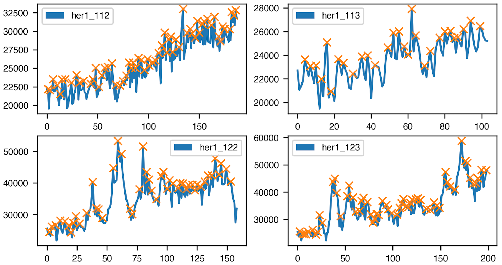

# CellTrackProcessing
Tools to plot and analyze oscillations from fiji tracks.
&nbsp;
<div align="center">
    
</div>

&nbsp;

## Installation

```sh
$ git clone https://github.com/sciencesteveho/CellTrackProcessing.git
```

## Dependencies

```sh
$ pip install numpy pandas more_itertools matplotlib scipy scikit-image
```

&nbsp;

## Usage
FijiProcessor takes trackfile CSVs as input. CSVs are required to have the following headers:
1. 'FRAME' - indicates frame in the timelapse
2. 'TRACK_ID' - indicates the individual cell in the tissue
3. 'TOTAL_INTENSITY_CH1' or 'TOTAL_INTENSITY' - indicates level of fluorescence

&nbsp;

### Required arguments:
| Parameter     |       | Description                           |
|---------------|-------|---------------------------------------|
| --a | _STR_ | Path to fiji trackfile for overlaying |
| --a_name      | _STR_ | Name of fluorescent transgene         |

&nbsp;

### Optional Arguments:
| Parameter           |       | Description                                                 |
|---------------------|-------|-------------------------------------------------------------|
| --peak_detection    |       | Use scipy's peak detection                                  |
| --num_peaks_filter  | _INT_ | Only keep tracks with minimum n number of detected peaks    |
| --periodicity       |       | Plot the periodicity of each trackfile instead of intensity |
| --fourier_transform |       | Plot fourier transformed intensity                          |
| --b       | _STR_ | Path to second fiji trackfile for overlaying                |
| --b_name            | _STR_ | Name of second fluorescent gene for overlaying              |

&nbsp;

Note: not all arguments are compatible with one another, so see examples below for the program's capabilities.
```sh
# plot a single trackfile
$ python cell_track_processor.py \
    --a ../single_cells.csv \
    --a_name her1 
```

```sh
# plot a single track file w/ peak detection and a minimum of 2 peaks per dataset
$ python cell_track_processor.py \
    --a ../single_cells.csv \
    --a_name her1 \
    --peak_detection \
    --num_peaks_filter 2
```

```sh
# plot periodicity (frames between peaks)
$ python cell_track_processor.py \
    --a ../single_cells.csv \
    --a_name her1 \
    --peak_detection \
    --num_peaks_filter 2 \
    --periodicity
```

```sh
# plot fourier transformed graphs (frequency)
$ python cell_track_processor.py \
    --a ../single_cells.csv \
    --a_name her1 \
    --fourier_transform
```

```sh
# plot two trackfiles merged
$ python cell_track_processor.py \
    --a ../her1.csv \
    --b ../securin.csv \
    --b_name her1 \
    --gene_2 securin 
```
&nbsp;
## Authors
____________

* Steve Ho
* Daniel McCusker


